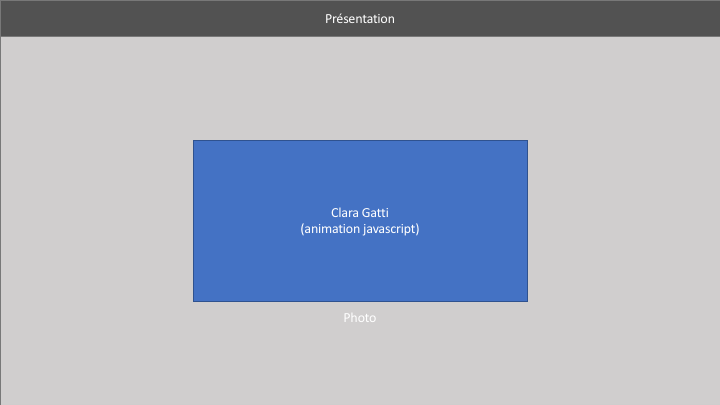
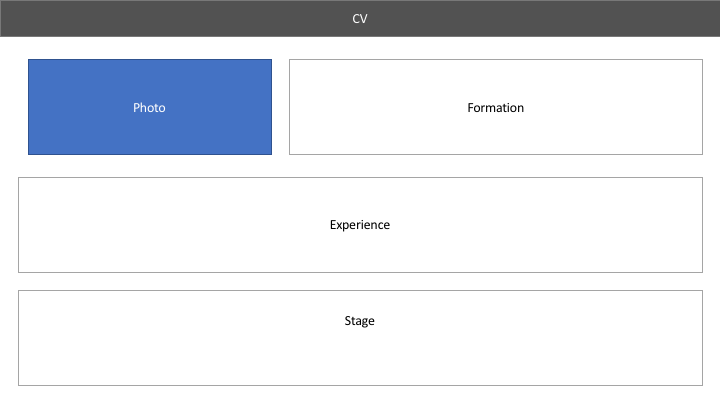
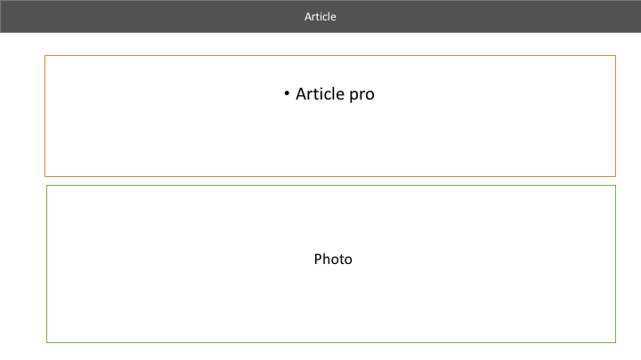
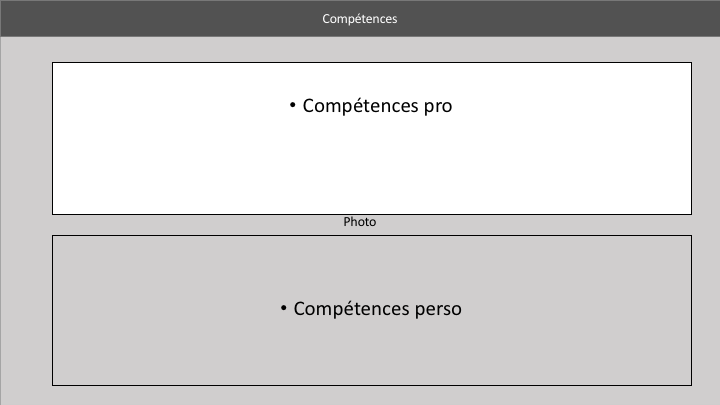
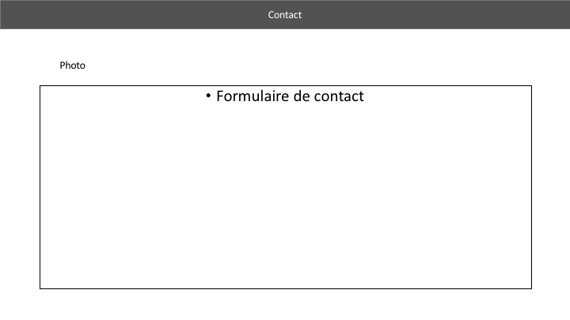

# Mon cv en ligne

L'objectif de ce site est de proposer mon CV en ligne aux entreprises pour ma recherche d'alternance. Le site proposera 4 pages différentes en accès direct sur le **header** : "Présentation" ; "CV"; "Compétences", "contact"

Cible : 
Mon CV s'adresse aux grands groupes basés à Lyon. 
Dans le domaine du médical, de l'agro-alimentaire ou du tourisme. 

# Présentation
**Clara GATTI** (avec animation javascript)
Explication sur ma personne et mon blog : Qui je suis et ce que je cherche : 
"alternance en marketing".

# CV

Description de : 
- Mes formations 
- Mon expérience professionnelle
- Mes stages

Sur certaines lignes seront en lien des articles. 
Par exemple, dans mon expériences professionnelles, un lien amènera à un article sur mon alternance.

Il est prevu d'écrire des articles sur les moments importants de ma vie professionnelle. 

## Compétences
Faire un listing de mes compétences professionnelles d'un côté et mes compétences personnelles de l'autre. 
Mettre des "barres de chargement" avec des pourcentages en fonction de mes compétences.  

Utiliser au minima les mêmes compétences que celles citées sur mon blog.

## Contact
Mettre un lien contact avec un envoie de mail possible. 
Numéro de téléphone, Compte Linkedin et mail mis à disposition.

